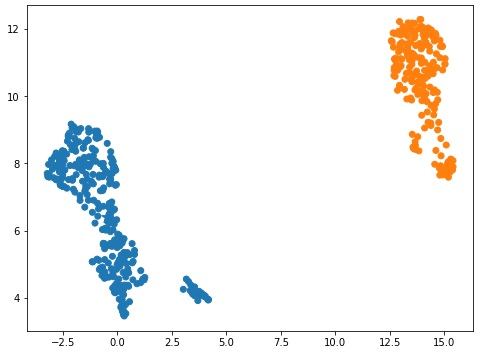
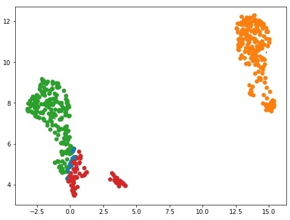
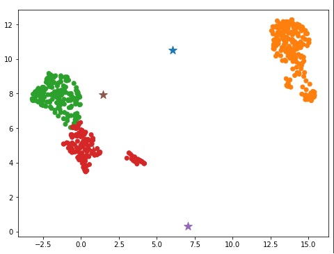
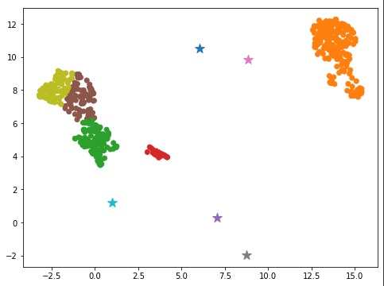

# Clustering-with-map-and-reduce
This is a university project where we did preprocessing and clustering with map and reduce functions of cell genome expressions. 
 
The best way to run this would be to put it into google colab and run cells one after another. 
 
The results with: 
 
### 2 clusters

 
### 4 clusters

 
### 6 clusters

 
### 10 clusters

